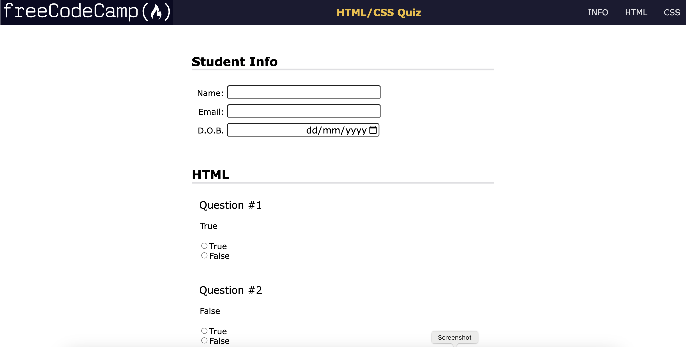

# Building FreeCodeCamp Accessibility Quiz App
This guide explores the HTML, CSS, and accessibility features used to create a simple quiz application. We'll focus on the most important aspects you learned while building this project.

## Understanding Accessibility

Accessibility ensures everyone can perceive, understand, navigate, interact with, and contribute to web content. It's crucial for users with disabilities to access information effectively.

## HTML for Accessibility

### Let's look at some key accessibility elements in the HTML:

Semantic Structure: The code uses HTML elements that describe their content, like header, nav, main, and section. Screen readers interpret these elements for users.

```html
<header>
  <h1>Quiz App</h1>
</header>
```

### Headings: 
Headings (`h1 to h6`) structure the content and help users understand the information hierarchy.

```html
<h2>HTML Questions</h2>
```

### Navigation:
 A clear navigation bar (`nav`) with links (`a) allows users to jump to specific sections. Access keys (accesskey) provide keyboard shortcuts (e.g., "i" for info section).

```html
<nav>
  <ul>
    <li><a href="#info" accesskey="i">INFO</a></li>
  </ul>
</nav>
```

### Form Accessibility: 
The form element groups form fields `input, select, textarea). Labels` `(label)` are associated with each field using the for attribute for screen readers.

```html
<label for="name">Name:</label>
<input type="text" id="name" />
```

### Landmarks: 
`ARIA` attributes (`role, aria-labelledby`) define regions within the content for screen readers, aiding navigation.

```html
<section role="region" aria-labelledby="student-info">
  <h2>Student Info</h2>
</section>
```

## CSS for Accessibility

### CSS complements HTML for an accessible experience:

Focus Styles: While styles aren't shown here, it's recommended to include clear visual cues (like a colored outline) for elements with keyboard focus (like buttons and form fields). This helps users know which element is selected.
Additional Considerations

### Images: 
Include alt attributes describing the image content for screen readers.
Keyboard Navigation: Ensure all interactive elements are accessible via keyboard controls (Tab key navigation).
Responsive Design: Use responsive design techniques to ensure the quiz app adapts to different screen sizes and devices.

## Acknowledgement

This project is built upon the guidance provided by freeCodeCamp. Their challenges and resources offer valuable learning opportunities for aspiring web developers.