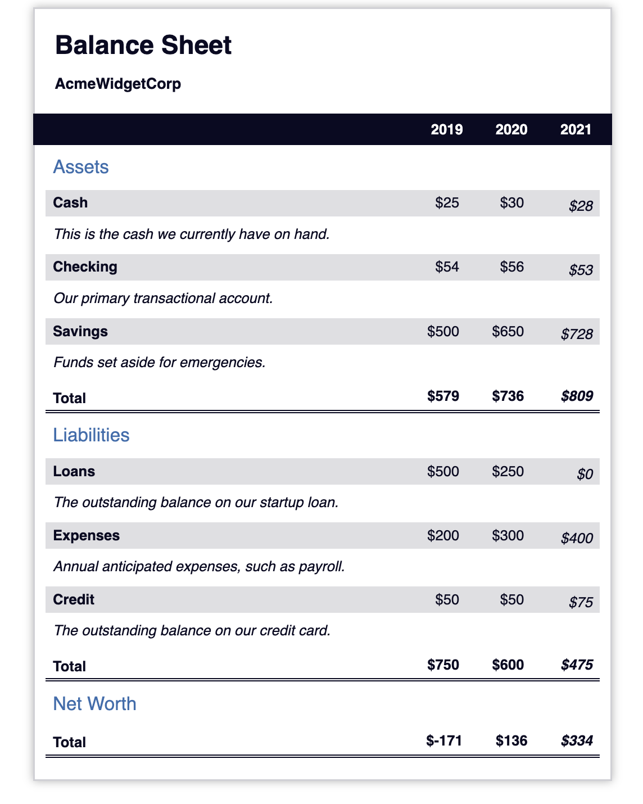

# Balance Sheet Project Readme
This file explains the code for the Balance Sheet project, the skills you can learn by following it, and the specific skills used in the CSS coding.

## Skills Learned:

### HTML Basics: 
Creating the basic structure of the webpage using `HTML` elements like tables, headings, and sections.
`CSS Fundamentals`: Applying styles to the `HTML` elements using CSS selectors and properties to control layout, font, color, and more.
Responsive Design Concepts: Implementing basic media queries to adjust the layout for different screen sizes.
Document Accessibility: Using semantic `HTML` elements and techniques like aria-hidden to improve accessibility for users with disabilities.

## CSS Skills:

### Pseudo-selectors:
:first-of-type and :last-of-type target the first and last child elements of a specific selector (used for styling the company name and balance sheet title).
`:not()` targets elements that don't match a specific selector (used for general table styling).
`:nth-of-type()` targets specific elements based on their order among siblings (used for adding a right padding to the last data column in the total row).
:hover applies styles when the user hovers over an element (used to add a hover effect to the total row).
`Flexbox:` Used for layout purposes, like displaying the company name and balance sheet title in a column on smaller screens.
Positioning: Used to position the "Years" element at the top of the viewport and make it sticky.
Responsive Design Media Queries: Adjust layout and styles for different screen sizes to ensure a good user experience on various devices.

Code Snippet - Using Pseudo Selectors for Table Styling:

### This code snippet demonstrates how pseudo-selectors are used to style the table's total row:

```css
/* Targets the "total" class rows and adds a double border to the bottom */
tr[class="total"] {
  border-bottom: 4px double #0a0a23;
  font-weight: bold;
}

/* Styles the th element within the "total" row */
tr[class="total"] th {
  text-align: left;
  padding: 0.5rem 0 0.25rem 0.5rem;
}

/* Styles the td elements within the "total" row */
tr.total td {
  text-align: right;
  padding: 0 0.25rem;
}

/* Targets the last td element within the "total" row and adds extra padding to the right */
tr.total td:nth-of-type(3) {
  padding-right: 0.5rem;
}

/* Applies a hover effect (background color) to the "total" row */
tr.total:hover {
  background: #99c9ff;
}
```
## Acknowledgements:

A big thanks to FreeCodeCamp `(https://www.freecodecamp.org/)` for providing this project and many others like it. FreeCodeCamp offers a fantastic platform for beginners to learn and practice essential web development skills. I highly recommend it to anyone interested in coding and web development.