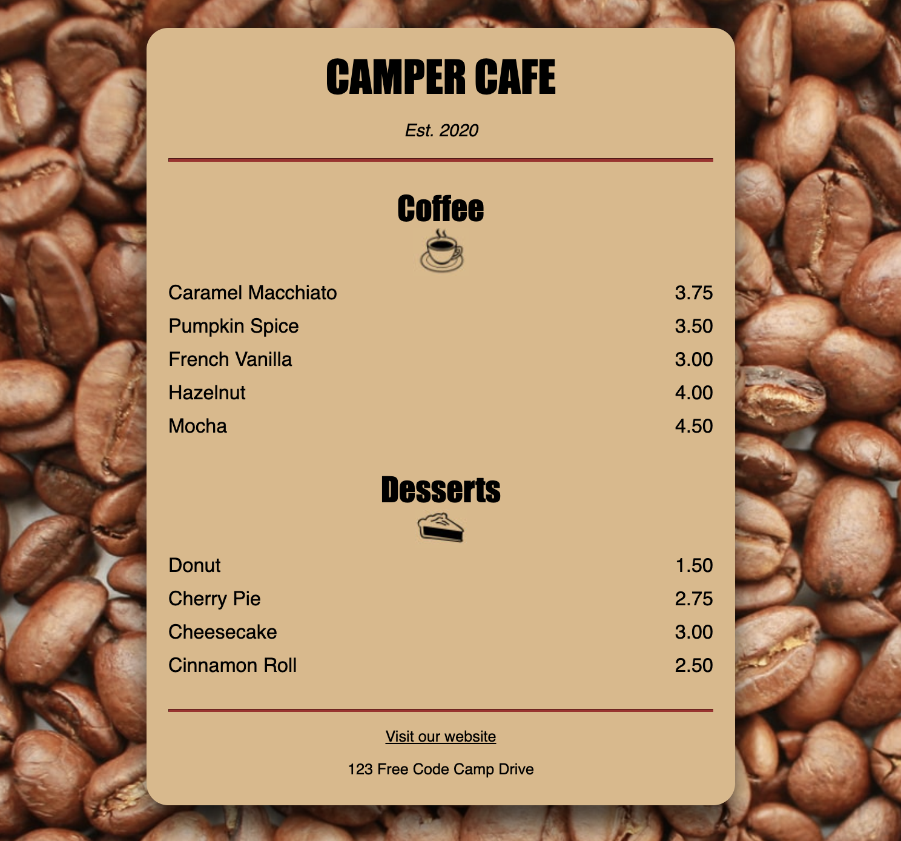

# Cafe Menu Styling

This `README` explains the effect of each styling added to the Cafe Menu web page and highlights the skills one would learn from using these style properties.

## Table of Contents

- `Body Styles`
- `Heading Styles`
- `Italicized Text`
- `Center Alignment for Headings and Paragraphs`
- `Menu Styles`
- `Horizontal Rule Styles`
- `Bottom Line Margin`
- `Heading Font Family`
- `Item Paragraph Styles`
- `Flavor and Dessert Styles`
- `Price Styles`
- `Footer Styles`
- `Anchor Styles`
- `Address Styles`
- `Image Styles`

## Body Styles

- `Effect: Sets the background image to beans.jpg and applies a sans-serif font to the entire page`.
- `Skills Learned: Background image usage, font-family styling.`

```css
body {
  background-image: url(https://cdn.freecodecamp.org/curriculum/css-cafe/beans.jpg);
  font-family: sans-serif;
  padding: 20px;
}
```

## Heading Styles

- `Effect: Adjusts the font size of h1 and h2, creating a visually appealing hierarchy for headings.`
- `Skills Learned: Font-size manipulation for different heading levels.`

```css
h1 {
  font-size: 40px;
  margin-top: 0;
  margin-bottom: 15px;
}

h2 {
  font-size: 30px;
}
```

## Italicized Text

- `Effect: Applies italic style to text with the class "established."`
- `Skills Learned: Font-style property usage for emphasis.`

```css
.established {
  font-style: italic;
}
```

## Center Alignment for Headings and Paragraphs

- `Effect: Centers h1, h2, and p elements.`
- `Skills Learned: Text alignment for improved page layout.`

```css
h1,
h2,
p {
  text-align: center;
}
```

## Menu Styles

- `Effect: Styles the menu container with a background color, padding, border-radius, and box-shadow for a visually appealing appearance.`
- `Skills Learned: Container styling, box-shadow application.`

```css
.menu {
  width: 80%;
  background-color: burlywood;
  margin-left: auto;
  margin-right: auto;
  padding: 20px;
  max-width: 500px;
  border-radius: 10px;
  box-shadow: 0 20px 25px rgba(0, 0, 0, 0.7);
}
```

## Horizontal Rule Styles

- `Effect: Sets the color and height of horizontal rules for a consistent and visually appealing design.`
- `Skills Learned: Styling horizontal rules`.

```css
hr {
  height: 2px;
  background-color: brown;
  border-color: brown;
}
```

## Bottom Line Margin

- `Effect: Adds margin to elements with the class "bottom-line," creating separation from the elements above`.
- `Skills Learned: Margin application for spacing.`

```css
.bottom-line {
  margin-top: 25px;
}
```

## Heading Font Family

- `Effect: Applies a specific font family (Impact, serif) to h1 and h2.`
- `Skills Learned: Font-family selection for improved aesthetics.`

```css
h1,
h2 {
  font-family: Impact, serif;
}
```

## Item Paragraph Styles

- `Effect: Displays paragraphs inline within item containers with specific styling.`
- `Skills Learned: Inline-block display usage for paragraph alignment.`

```css
.item p {
  display: inline-block;
  margin-top: 5px;
  margin-bottom: 5px;
  font-size: 18px;
}
```

## Flavor and Dessert Styles

- `Effect: Aligns text to the left for elements with the classes "flavor" and "dessert," controlling their width.` +` Skills Learned: Text alignment and width adjustment.`

```css
.flavor,
.dessert {
  text-align: left;
  width: 75%;
}
```

## Price Styles

- `Effect: Aligns text to the right for elements with the class "price," controlling their width.`
- `Skills Learned: Text alignment and width`

```css
.price {
  text-align: right;
  width: 25%;
}
```

## Footer Styles

- `Effect: Adjusts the font size for the footer element.`
- `Skills: Footer styling, font size manipulation.`

```css
footer {
  font-size: 14px;
}
```
 ## Anchor Styles
+ `Effect: Defines styles for normal, visited, hover, and active states of anchor elements.`
+ `Skills: Styling anchor elements, pseudo-classes.`
```css
a {
  color: black;
}

a:visited {
  color: black;
}

a:hover {
  color: brown;
}

a:active {
  color: brown;
}
```

## Address Styles
+ `Effect: Adds bottom margin to elements with the class "address".`
+ `Skills: Class-based styling, margin manipulation.`
```css
.address {
  margin-bottom: 5px;
}
```
## Image Styles
+ `Effect: Centers images by setting display, margin-left, margin-right, and margin-top.`
+ `Skills: Image styling, centering images.`
```css
img {
  display: block;
  margin-left: auto;
  margin-right: auto;
  margin-top: -25px;
}
```