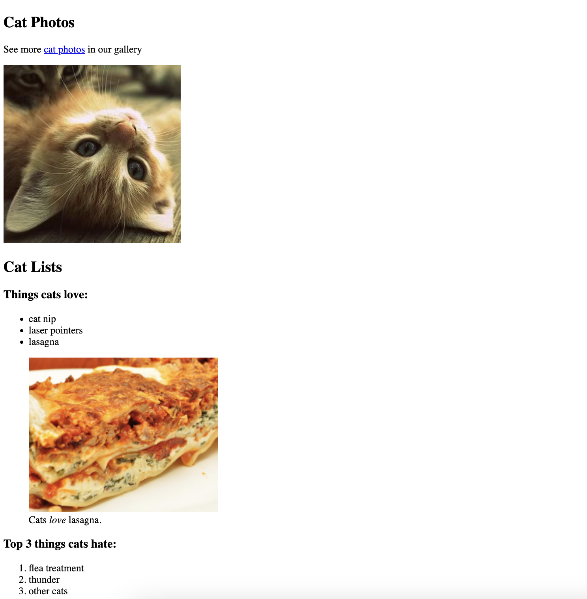

# CAT PHOTO APP

## Learning Objectives for Beginners
While working on this project, beginners can learn and practice the following HTML concepts:

- Creating HTML elements such as headings, paragraphs, links, images, - lists, forms, and fieldsets.
- Using attributes like id, type, name, value, checked, and for.
- Nesting HTML elements for proper structure.
- Understanding the purpose of a legend element in a fieldset.
- Implementing radio buttons and checkboxes within a form.
- Creating anchors for links and embedding images.
- Structuring a webpage with sections `(main, footer)` for better readability.
- Setting up a simple form with input fields and a submit button.

This is the source code for the CatPhotoApp, a simple web page showcasing cat photos, lists of things cats love and hate, and a cat photo submission form.

## Getting Started
To view the CatPhotoApp, simply open the `index.html` file in your preferred web browser. The page includes sections with cat photos, lists, and a submission form for cat photos.

## Project Structure
`index.html`: The main HTML file containing the structure of the CatPhotoApp.
`html-img.png`: The favicon for the web page.
Features

## Cat Photos Section:
Displays a header `(h2)` with the title "Cat Photos."
Provides a link to more cat photos in the gallery.

## Cat Lists Section:
Lists things cats love and hate.
Includes images illustrating cats' love for lasagna and their dislike for other cats.
Demonstrates nesting images inside a figure element with `figcaption`.

## Cat Form Section:
Implements a form for submitting cat photos.
Includes radio buttons for specifying if the cat is indoor or outdoor.
Provides checkboxes to capture the cat's personality (Loving, Lazy, Energetic).
Requires a cat photo URL for submission.
Footer:

Displays a footer with a copyright notice and a link to freeCodeCamp.org.

## Acknowledgments
The CatPhotoApp is created as part of the learning resources provided by `freeCodeCamp.org.`