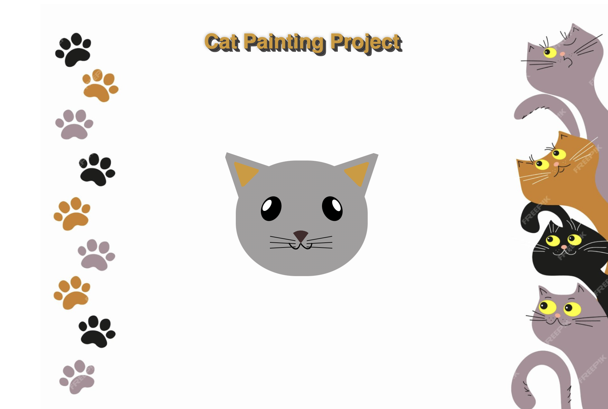

# Cat Painting Project Readme

This readme explains the HTML and CSS code used to create a cute cat painting illustration. By following along and building this project, you'll learn valuable web development skills!

## Skills Learned:

### HTML Basics:

Creating the basic structure of the webpage using HTML elements like divs for sections and styling with classes.

### CSS Fundamentals:

Applying styles to `HTML elements` using` CSS selectors` and properties to control layout, size, color, positioning, and more.
Using basic transformations like rotate and transform to position and tilt elements.

### Descendant Selectors:

Targeting specific elements nested within other elements using the child > or descendant operators in CSS selectors.
Code Breakdown:

The` HTML code` defines the overall structure of the webpage, including the title and a main section (`main`) that contains the cat illustration.

The `CSS code styles` the various elements that make up the cat. Let's look at some code snippets for key concepts:

#### 1. Positioning the Cat's Head:

```css
.cat-head {
  /* Absolute Positioning */
  position: absolute;
  top: 0px;
  right: 0;
  left: 0;
  bottom: 0;
  margin: auto auto;
}
```

This code positions the element with class cat-head using `absolute positioning`. This removes it from the normal document flow and allows you to place it precisely within the viewport using `top, right, left`, and `bottom properties`. `margin: auto auto`; centers the element horizontally and vertically within its containing element.

#### 2. Rotating the Cat's Ears:

```css
.cat-left-ear {
  transform: rotate(-45deg);
}

.cat-right-ear {
  transform: rotate(45deg);
}
```

The transform property allows you to manipulate the position, size, and shape of elements. Here, rotate is used to tilt the left ear `(cat-left-ear)` `45 degrees counter-clockwise` with a negative value and the right ear `(cat-right-ear) 45 degrees` clockwise with a positive value.

#### 3. Descendant Selector for Cat's Mouth:

```css
.cat-mouth div {
  /* Decendant Selector*/
  width: 30px;
  height: 50px;
  border: 2px solid #000;
  border-color: black transparent transparent transparent;
  border-radius: 190%/190px 150px 0 0;
}
```

This code demonstrates a descendant selector. It targets all div elements that are nested within (children of) the element with the class cat-mouth. The div elements represent the two lines forming the mouth. They are styled with` width, height, border,` and a specific border-radius to create the curved mouth shape.

## Acknowledgements:

A big thanks to `FreeCodeCamp` (https://www.freecodecamp.org/) for providing resources and tutorials that help to create this project. `FreeCodeCamp` offers a fantastic platform for beginners to learn and practice essential web development skill