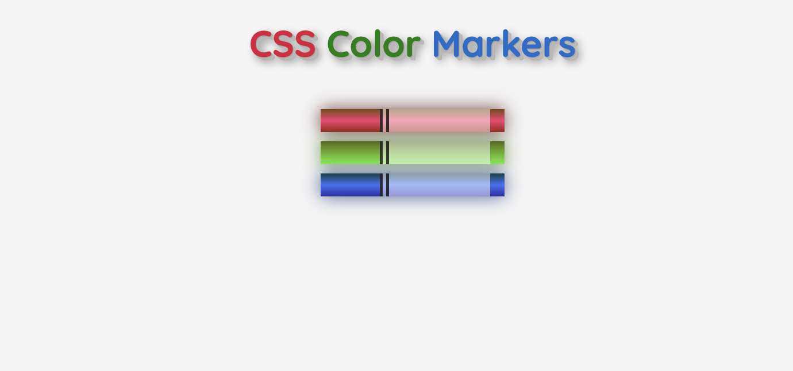

# Colored Markers Project
This `README` provides a detailed walkthrough of the Colored Markers project, explaining the `HTML markup` and `CSS styles` used to create colored markers. Let's dive into the concepts and implementation.

## Contents
+ `Explanation`
+ `HTML Markup`
+ `CSS Styles`
+ `Global Styles`
+ `Header Styling`
+ `Word Styling`
+ `Marker Styling`
+ `Container Styling`
+ `Acknowledgment`
+ `Explanation`
The project consists of `HTML markup` defining the structure of the page and `CSS styles` responsible for the visual appearance.

## HTML Markup
### HTML Explanation:
The `HTML` markup defines the structure of the page, consisting of a header and a container for colored markers.

## HTML Markup
```html
<!DOCTYPE html>
<html lang="en">
<head>
  <meta charset="UTF-8" />
  <meta name="viewport" content="width=device-width, initial-scale=1.0" />
  <link rel="shortcut icon" href="image/markers.png" type="image/x-icon" />
  <link rel="stylesheet" href="styles.css" />
  <title>Colored Markers</title>
</head>
<body>
  <h1>
    <span class="css-word">CSS</span>
    <span class="color-word">Color</span>
    <span class="markers-word">Markers</span>
  </h1>
  
  <div class="container">
    <!-- Markers -->
  </div>
</body>
</html>
```
## CSS Styles
The CSS styles define the visual appearance of the elements on the page, including global styles, styling for the header, word styling, marker styling, and container styling.

## Global Styles
Global styles include font-family and body background-color.
```css
/* Global styles */
* {
  font-family: "Quicksand", sans-serif; /* Set the font family for all elements */
}
body {
  background-color: whitesmoke; /* Set the background color for the body */
  margin: 0; /* Remove default margin */
  padding: 0; /* Remove default padding */
}
```
## Header Styling
The header styling defines the appearance of the `h1` element, including text alignment, font size, and text shadow.
```css
/* Header Styling */
h1 {
  text-align: center; /* Center-align the text */
  font-size: 2.5em; /* Set the font size */
  font-weight: bolder; /* Set the font weight */
  text-shadow:
  1px 1px 0 #aeaaaa, 
  2px 2px 0 #c1bbbb, 
  3px 3px 0 #bab7b7, 
  4px 4px 0 #bab5b5, 
  5px 5px 10px rgba(0,0,0,0.5); /* Add a text shadow effect */
}
```
## Word Styling
Word styling applies different colors to each span within the header.
```css
/* Word Styling */
.css-word {
  color: crimson; /* Set the color of the "CSS" span */
}
.color-word {
  color: green; /* Set the color of the "Color" span */
}
.markers-word {
  color: rgb(16, 109, 202); /* Set the color of the "Markers" span */
}
```
## Marker Styling
Marker styling defines the appearance of colored markers, including dimensions and gradients for each color.
```css
/* Marker Styling */
.marker {
  height: 25px; /* Set the height of the marker */
  width: 200px; /* Set the width of the marker */
  margin: 10px auto; /* Center the marker horizontally */
}

/* Red Marker Styling */
.red {
  background: linear-gradient(rgb(122, 74, 14), rgb(245, 62, 113), rgb(162, 27, 27)); /* Set a linear gradient background for red marker */
  box-shadow: 0 0 20px 0 rgba(83, 14, 14, 0.8); /* Add a box shadow effect */
}

/* Green Marker Styling */
.green {
  background: linear-gradient(#55680d, #71f53e); /* Set a linear gradient background for green marker */
  box-shadow: 0 0 20px 0 #3b7e20cc; /* Add a box shadow effect */
}

/* Blue Marker Styling */
.blue {
  background: linear-gradient(hsl(186, 76%, 16%), hsl(223, 90%, 60%), hsl(240, 56%, 42%)); /* Set a linear gradient background for blue marker */
  box-shadow: 0 0 20px 0 hsla(223, 59%, 31%, 0.8); /* Add a box shadow effect */
}
```
## Acknowledgment
This project is based on the design and requirements provided by `FreeCodeCamp`.


