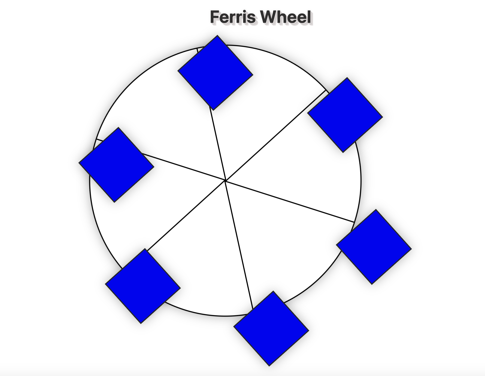

  

# Building a Ferris Wheel with CSS Animation

## Project Overview: 
This project involves creating a Ferris wheel using HTML and CSS animation. By building this project, beginners can learn several key concepts and skills, including:

1. `HTML Markup:` Understanding the structure of HTML elements to represent a Ferris wheel.
2. `CSS Animation:` Implementing animations using keyframes (@keyframes) and animation properties (animation-name, animation-duration, animation-timing-function, animation-iteration-count).
3. `Using :nth-child() Selector`: Applying styles to specific child elements based on their position within a parent container.
4. `Transformations:` Utilizing the transform property to rotate elements (rotate) and set the origin point of transformations (transform-origin).
5. `Creating Smooth Animations:` Applying different timing functions (linear, ease-in-out) to achieve desired animation effects.
6. `Responsive Design:` Adapting the Ferris wheel layout to different screen sizes using media queries (@media).
***
## Table of Contents
+ `Project Overview`
+ `Core HTML Markup`
+ `Key Features of CSS Animation`
+ `Working with :nth-child() Selector`
+ `Defining Keyframes (@keyframes)`
+ `Applying Animation Properties`
+ `Skills Learned`
+ `Acknowledgment`

## Core HTML Markup for Ferris Wheel Project
```html
  <div class="wheel">
            <span class="line"></span>
            <span class="line"></span>
            <span class="line"></span>
            <span class="line"></span>
            <span class="line"></span>
            <span class="line"></span>
            <div class="cabin"></div>
            <div class="cabin"></div>
            <div class="cabin"></div>
            <div class="cabin"></div>
            <div class="cabin"></div>
            <div class="cabin"></div>
          </div>
``` 
+ Note: The `wheel` class is used to create the Ferris wheel structure, and the `line` class is used to create the spokes of the wheel. The `cabin` class is used to create the cabins that will rotate around the wheel.
***
## Key Features of CSS Animation
Working with :nth-child() Selector
Defining Keyframes (@keyframes)
Applying Animation Properties
Skills Learned
Acknowledgment  


## Key Features of `CSS Animation`

The :nth in the CSS selector `:nth-child()` is used to target elements based on their position within a parent element. Essentially,` :nth` enables you to apply styles or perform actions on specific child elements based on their order within their parent container.

---

The `transform-origin` property is used to set the point around which a CSS transformation is applied, and determines around which point the element is rotated.
transform-origin property of 0% 0%. This will offset the origin point by 0% from the left and 0% from the top, setting it to the top left corner of the element.

```css
.line {
  background-color: black;
  width: 50%;
  height: 2px;
  position: absolute;
  left: 50%;
  top: 50%;
  transform-origin: 0% 0%;
}
```

---
## Working With  Keyframes

The `@keyframes` at-rule is used to define the flow of a CSS animation. Within the @keyframes rule, you can create selectors for specific points in the animation sequence, such as 0% or 25%, or use from and to to define the start and end of the sequence.

`@keyframes` rules require a name to be assigned to them, which you use in other rules to reference.
For example, the `@keyframes` ferrisWheel { } rule would be named `ferrisWheel`.

```css
@keyframes ferrisWheel {
  0% {
    transform: rotate(0deg);
  }
  100% {
    transform: rotate(360deg);
  }
}
```

---

The animation-name property is used to link a @keyframes rule to a CSS selector. The value of this property should match the name of the @keyframes rule.

### For example,

if you have a `@keyframes` rule named `ferrisWheel`, you would link it to a CSS selector using the `animation-name` property like this:

```css
.ferris-wheel {
  animation-name: ferris-wheel;
}
```
---
We can use `@keyframes` rules to `control` more than just the `transformation` of an element. In the `0% selector` of the `@keyframes cabins`, we will set the `background-color` to yellow.

### For Example:
```css
@keyframes cabins {
  0% {
    background-color: yellow;
    transform: rotate(0deg);
  }
  100% {
    background-color: yellow;
    transform: rotate(360deg);
  }
}
``` 

The `animation-duration` property is used to set how long the animation should sequence to complete. The time should be specified in either seconds `(s)` or milliseconds` (ms)`.

#### For Example,

To make an `animation` last for 10 seconds, you would set the `animation-duration` property to `10s` like this:

```css
.wheel {
  animation-duration: 10s;
}
```
---

The `animation-iteration-count` property sets how many `times` your animation should repeat. This can be set to a `number`, or to `infinite` to indefinitely repeat the animation.

The `animation-timing-function` property sets how the animation should `progress over time`. There are a few different values for this property, but we want the `Ferris wheel animation` to run at the same rate from start to finish. So we set the `animation-timing-function to linear` in your our `.wheel` selector.

#### For example,

```css
.wheel {
  animation-iteration-count: infinite;
  animation-timing-function: linear;
}
```
---
To make the cabin animation seem more like a natural swinging motion, we can use the `ease-in-out timing function`. This setting will tell the animation to `start` and `end` at a slower pace, but move more quickly in the `middle` of the cycle.

#### For example,
```css
.cabin {
 animation: cabins 10s ease-in-out infinite;
}
```
---
## Skills Learned
+ HTML markup for complex structures
+ Creating animations using CSS keyframes
+ Selecting and styling elements based on their position in the document
+ Applying transformations and transitions to achieve desired visual effects
***
## Acknowledgment
This project was completed as part of the `freeCodeCamp` curriculum, which provides comprehensive resources and tutorials for learning web development.
