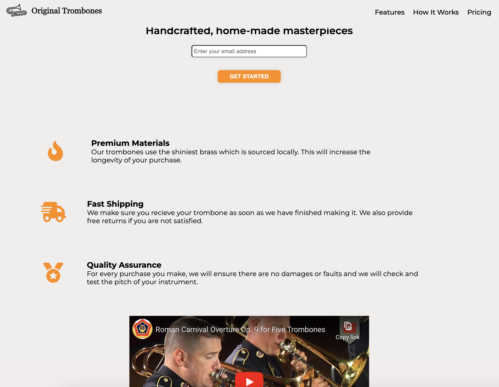

# Product Landing Page
This is a project that beginner-level developers will learn valuable conspets from, it involves creating a product landing page. The landing page is for a company that sells trombones, and it showcases various features of their product, provides information on how it works, displays pricing options, and includes a contact form. The project helps beginners learn about HTML, CSS, and responsive web design techniques.

---

## Table of Contents
+ `Overview`
+ `Skills Learned`
+ `Project Structure`
+ `Sample Code Snippet`
+ `Flexbox Styling`
***
## Overview
This project involves creating a product landing page for a trombone company. The landing page includes a header section with a `logo` and `navigation links`, a hero section with a `call-to-action form`, sections for showcasing product features, a video demonstration, pricing options, and a `footer` with links and` copyright` information.

---

## Skills Learned
By completing this project, beginners will learn:

`HTML` markup for structuring web pages
`CSS` styling for layout and design
`Responsive` web design techniques using `media queries`
Using `Flexbox `for layout and alignment
Adding interactive elements like `buttons` and `forms`
***
## Project Structure
The project consists of several sections:
Header: Contains the company logo and navigation links.
`Hero Section`: Includes a headline and a `call-to-action form` for users to sign up.
Features Section: Displays key features of the product using icons and descriptions.
How It Works Section: Embeds a video demonstration of the product.
Pricing Section: Lists pricing options for different trombone models.
`Footer`: Contains links to privacy, items, and contact pages, along with copyright information.

---

### Sample Code Snippet
Here's a sample code snippet demonstrating how the `form` and `submit button` are styled using `CSS:`

```html
<!-- HTML Markup for Form -->
<form id="form" action="https://www.freecodecamp.com/email-submit">
  <input id="email" type="email" name="email" placeholder="Enter your email address" required />
  <input id="submit" type="submit" value="GET STARTED" class="btn" />
</form>
```
***
```css
/* CSS Styling for Form and Submit Button */
#hero #form {
  display: flex;
  flex-direction: column;
  justify-content: center;
  align-items: center;
}

#hero input[type="submit"] {
  max-width: 150px;
  width: 100%;
  height: 30px;
  border-radius: 6px;
  border: none;
  background-color: darkorange;
  font-weight: bold;
  padding: 4px 4px;
  margin-bottom: 80px;
  box-shadow: 0 0 10px rgba(146, 144, 144, 0.3);
}
```
***
### Flexbox Styling Examples
`Flexbox` is used extensively throughout the project for layout and alignment. Here's how it's used to style the product cards in the pricing section:
```css
/* Pricing Section Styling with Flexbox */
#pricing {
  margin-top: 60px;
  display: flex;
  justify-content: center;
  text-align: center;
}

.product {
  display: flex;
  flex-direction: column;
  align-items: center;
  text-align: center;
  width: calc(100% / 3);
  margin: 10px;
  border: 1px solid black;
  border-radius: 6px;
  box-shadow: 0 0 15px 0 rgba(134, 133, 133, 0.5);
}
```
`Flexbox` allows for `easy alignment` of elements within a container, making it ideal for creating responsive and visually appealing layouts.
***

## Acknowledgement
This project was completed as part of the `FreeCodeCamp curriculum`, which offers a hands-on approach to learning web development skills.