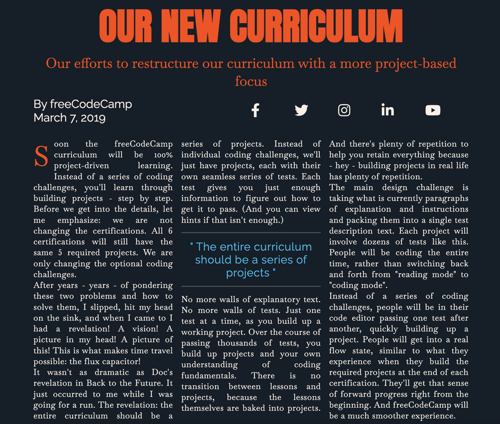

# Magazine Project: Learning Basic CSS
This project allows you to learn and practice fundamental CSS skills to create a magazine-like layout with a responsive design.

## Table of Contents
- `Learning Objectives`
- `HTML Structure`
- `CSS Styling`
- `Basic Styles`
- `Grid Layout`
- `Responsive Design`
- `Learning Objectives`
#### By building this magazine project, you'll gain experience with the following CSS concepts:

## Basic Styles:
- `Selecting elements with selectors`
- `Setting font properties (family, size, color)`
- `Applying margins and padding`
- `B ackground colors and images`
- `Text decoration and alignment`
## Grid Layout:
- `Introduction to CSS Grid`
- `Defining grid columns and rows`
- `Responsive grid behavior`
- `Responsive Design:`
- `Media queries for different screen sizes`
- `Adjusting styles based on device width`
- `HTML Structure`
#### The HTML structure provides the foundation for the webpage content and organization. Here's a breakdown of some key elements:

```html
<!DOCTYPE html>
<html>
  <head>
    <title>Magazine</title>
    <link rel="stylesheet" href="style.css" />
  </head>
  <body>
    <main>
      <section class="heading">...</section>
      <section class="text">...</section>
    </main>
  </body>
</html>
```
---
```html
<!DOCTYPE html>: Defines the document type as HTML.
<html>: The root element of the HTML document.
<head>: Contains meta information about the webpage.
<title>: Sets the title of the webpage.
<link rel="stylesheet" href="style.css">: Links the external CSS stylesheet.
<body>: Contains the visible content of the webpage.
<main>: The main content section of the webpage.
<section>: Defines a thematic section within the webpage.
```    
#### Classes are used to group elements with similar styles (e.g., .heading, .text).
***
## CSS Styling
The CSS stylesheet defines the visual appearance and layout of the webpage elements. Let's explore some key concepts:

## Basic Styles
Selecting Elements: CSS uses selectors to target specific elements in the HTML document. Here are some examples:

.heading: Selects all elements with the class `"heading".`
h1: Selects all `h1` heading elements.
a: Selects all anchor tags `(a).`
Font Properties: You can control the font family, size, and color of text elements:

font-family: Specifies the font used for the element `(e.g., font-family: Arial, sans-serif;).`
font-size: Sets the size of the text `(e.g., font-size: 16px;).`
color: Defines the text color` (e.g., color: #FF0000; for red).`
Margins and Padding: Margins and padding add space around elements:

margin: Sets the margin around an element `(e.g., margin: 10px;).`
padding: Sets the padding inside an element `(e.g., padding: 5px;).`
Backgrounds: Define background colors or images for elements:

background-color: Sets the background color `(e.g., background-color: lightblue;)`.
background-image: Sets a background image `(e.g., background-image: url("image.jpg");).`
Text Decoration and Alignment:

text-decoration: Control underline, strikethrough, etc. (`e.g., text-decoration: none;` to remove underline from links).
text-align: Align text content `(e.g., text-align: center; to center text()`
Grid Layout
This project utilizes CSS Grid to create a flexible and responsive layout. Here's a basic overview:

Grid Container: Defined using the display: grid property.
Grid Tracks: Divide the container into rows and columns using properties like grid-template-columns and grid-template-rows.
Grid Items: Individual elements placed within the grid cells.
For instance:
```css
.text-with-images {
  display: grid;
  grid-template-columns: 1fr 2fr;  /* Defines two columns */
}
```
***
Media Query: This code targets devices with a maximum `width of 768 pixels`, such as tablets and phones.
Heading Size Adjustment: The `font-size` of the .heading elements is reduced to `24px` for better readability on smaller screens.
Grid Layout Adjustment: The `grid-template-columns` property is changed to` 1fr`, converting the grid to a single column layout that's more suitable for smaller
```css
@media (max-width: 768px) {
  /* Styles for smaller screens, such as tablets and phones */
  .heading {
    font-size: 24px;  /* Adjust heading size for smaller screens */
  }

  .text-with-images {
    grid-template-columns: 1fr;  /* Change grid to a single column layout */
  }
}
```
***
## Acknowledgment:
We would like to express our gratitude to `FreeCodeCamp` for providing invaluable resources and tutorials that empower beginners to learn coding by creating engaging and practical projects. Their dedication to making programming accessible and enjoyable has greatly contributed to the growth and success of countless learners like me worldwide.