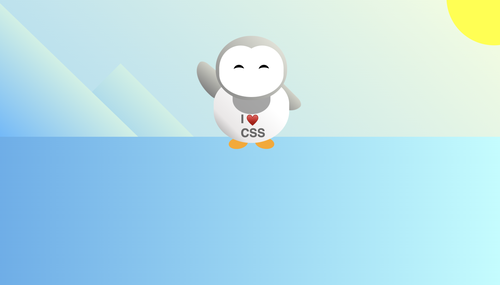

# Penguin Project
Welcome to the Penguin Project! This project is a fun and creative way to learn CSS styling while building an adorable penguin character. In this project, you'll use various CSS properties and techniques to create the visual elements of the penguin, such as its body, head, eyes, arms, and more.

## Table of Contents
+ `Introduction`
+ `HTML Structure`
+ `Core CSS Styling`
+ `Key CSS Concepts`
+ `Acknowledgement`

## Introduction
The Penguin Project is a beginner-friendly project aimed at helping learners understand fundamental CSS concepts by building a visually appealing penguin character using HTML and CSS. Through this project, beginners will gain hands-on experience in styling elements, `positioning`, `gradients`, `animations`, and more.

## HTML Structure 
The HTML structure of the Penguin Project consists of various `div `elements representing different parts of the penguin character, such as the head, body, eyes, arms, and feet. Additionally, there's a `div` element for the background mountains, sun, and ground.
```html
<div class="left-mountain"></div>
<div class="sun"></div>
<div class="penguin">
  <div class="penguin-head">
    <!-- Various elements for the penguin head -->
  </div>
  <div class="shirt">
    <!-- Shirt content -->
  </div>
  <div class="penguin-body">
    <!-- Various elements for the penguin body -->
  </div>
</div>
<div class="ground"></div>
```
These `div` elements represent the key components of the penguin character, such as the mountains, sun, penguin body, and ground.
***
## Core CSS Styling 
The core CSS styling for the Penguin Project includes setting up custom `CSS variables` for colors, defining styles for various penguin elements, creating animations for waving arms, and styling the background elements.
```css
/* Core CSS styling */
:root {
  --penguin-face: white;
  --penguin-picorna: orange;
  --penguin-skin: gray;
}

/* Styling for mountains, sun, and ground */
.left-mountain {
  /* Styling */
}

.sun {
  /* Styling */
}

.ground {
  /* Styling */
}

/* Styles for penguin elements */
.penguin {
  /* Styling */
}

/* More styles for penguin elements */
/* ... */
```
***
## Key CSS Concepts 
The Penguin Project covers several key CSS concepts, including:
### Using CSS variables for color management
Positioning elements using absolute positioning and transforms
Creating gradients for background styling
Implementing animations with keyframes
Understanding CSS transitions for smooth transformations

## Explanation:
The transform property in CSS allows you to apply various graphical transformations to an element. These transformations include rotating, scaling, skewing, and translating (moving) elements in two-dimensional or three-dimensional space.

```css
.penguin {
  width: 300px;
  height: 300px;
  margin: auto;
  margin-top: 75px;
  z-index: 4;
  position: relative;
  transition-property: transform; /* Specifies the property to be transitioned */
  transition-duration: 1s; /* Specifies the duration of the transition */
  transition-timing-function: ease-in-out; /* Specifies the timing function */
  transition-delay: 0ms; /* Specifies the delay before the transition starts */
}

.penguin:active {
  transform: scale(1.5); /* Scales the penguin element by 1.5 times when active */
}
```
The `.penguin` `class` represents the main penguin element.
The transform property is used to scale the penguin when it's active `(:active pseudo-class).`
The` scale(1.5)` value scales the penguin by 1.5 times its original size when it's active.
The `transition` property is used to smoothly `transition` the transformation over time, providing a visual effect.

***
## Acknowledgement 
This project was apart of the Responsive Web-Design curriculum provided by freeCodeCamp, an online learning platform that offers free coding courses to help people learn web development.