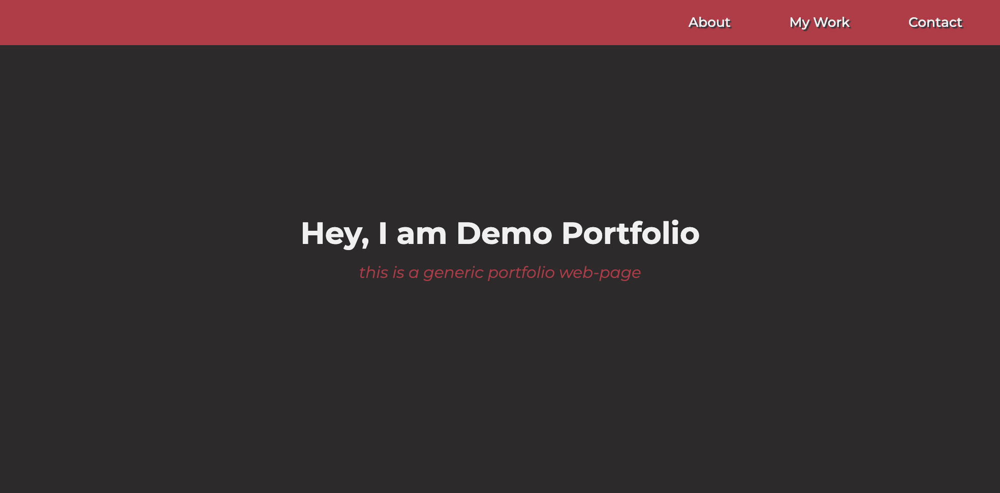
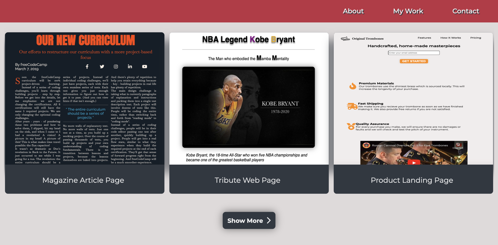
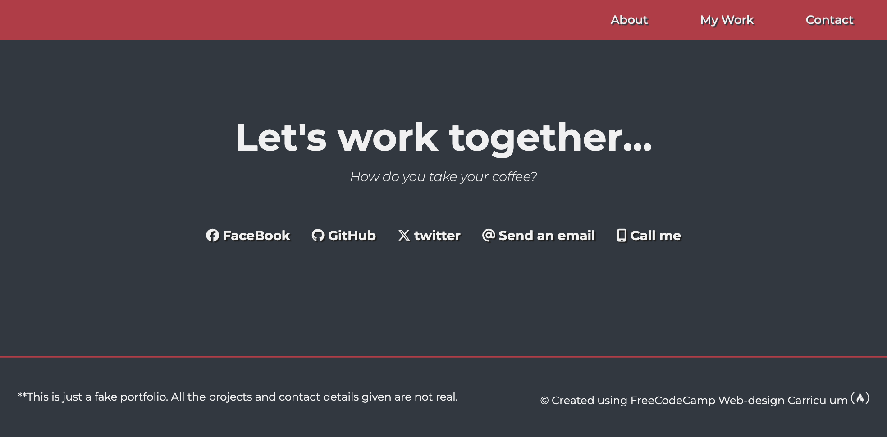

# Portfolio Project

## Table of Contents
+ Introduction
+ Project Sections
+ Welcome Section
+ My Work Section
+ Contact Section
+ Footer Section
+ Skills Learned
+ Acknowledgements

## Introduction
This portfolio project is designed to provide beginners with hands-on experience in building a responsive website using `HTML` and `CSS`. By completing this project, beginners will gain practical skills in structuring web pages, styling elements, and creating interactive components.

## Project Sections
### Welcome Section

```html
<section id="about_section" class="about_section">
  <h1>Demo Portfolio</h1>
  <p>Lorem ipsum dolor sit amet</p>
</section>
```

### Explanation:
The `about_section` class styles the container for the welcome section.
It sets the background color to _`#2c2a2a`_ and centers its contents both horizontally and vertically.

---

## My Work Section

```html
<section id="my_work" class="my_work_section">
  <h2 class="my_work_header">Lorem ipsum dolor sit amet</h2>
  <div class="projects_grid"></div>
</section>
```

### Explanation:
The `my_work_section` class styles the container for the projects section.
It sets the background color to _`var(--project-section-bg-color)`_ and provides padding to create space around the projects.

---

## Contact Section

```html
<section id="contact" class="contact_section">
      <div class="contact_section_header">
        <h2>"Lorem ipsum dolor sit amet, consectetur adipiscing elit, sed do eiusmod tempor   incididunt ut labore et dolore magna aliqua. </h2>
        <p>"Lorem ipsum dolor sit amet, consectetur adipiscing elit"</p>
      </div>
      <div class="contact_links">
</section>
```

### Explanation:
The _`contact_section`_ class styles the container for the contact section.
It sets the background color to _`var(--secondary-bg-color)`_ and centers its contents both horizontally and vertically.

---

## Footer Section

```html
<footer>
  <p>Lorem ipsum dolor sit amet, consectetur adipiscing elit.</p>
  <p>
    © Lorem ipsum dolor sit amet.
    <a href="https://www.freecodecamp.com/">
      FreeCodeCamp Web-design Carriculum
      <i class="fa-brands fa-free-code-camp"></i>
    </a>
  </p>
</footer>
```

### Explanation:
The footer element contains information about the portfolio creator and acknowledgements.
It uses _`flexbox`_ to align the content and sets the background color to _`var(--secondary-bg-color)`_

---

## CSS Snippets

```css
#nav-bar {
  display: flex;
  justify-content: flex-end;
  padding: 15px;
  background-color: var(--primary-bg-color);
  position: fixed;
  top: 0;
  width: 100%;
  z-index: 1000;
}
```

---

### Explanation:
This code styles the navigation bar _`(#nav-bar)`_ to be fixed at the top of the viewport.
It uses _`flexbox`_ to align the navigation links to the right side of the bar.

---

```css
.nav-link:hover,
.nav-link:focus {
  box-shadow: 0 0 10px rgba(0, 0, 0, 0.2);
  text-decoration: underline;
  text-underline-offset: 0.4rem;
}
```

### Explanation:
This code applies a _`box-shadow`_ effect and underlines the navigation links when hovered or focused. It enhances the visual feedback for users interacting with the navigation.

---

### Responsive Media Query
```css
@media screen and (max-width: 768px) {
  .nav-list {
    flex-direction: column;
    gap: 20px;
    padding-right: 0;
    align-items: center;
  }
  /* Add more responsive styles for smaller screens here */
}
```
---
### Explanation:
This _`media query`_ adjusts the navigation layout for screens with a _`maximum width of 768px`_ (typically smaller devices). It changes the flex direction to a column layout, reduces the gap between links, and centers the items vertically.

---
## Skills Learned
+ HTML structure and semantics
+ CSS styling and layout techniques
+ Responsive design principles
+ Navigation bar creation
+ Grid layout for project display
+ Form or link integration in the contact section
+ Footer design and positioning

---
## Acknowledgements
This project was completed using the _`FreeCodeCamp`_ _`Web Design Curriculum`_, which provided valuable resources and guidance for beginners in web development.

