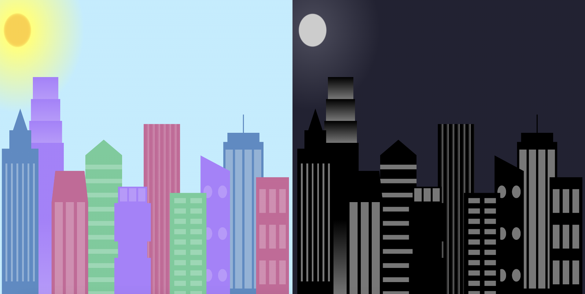

# Learn CSS variables By Building a Skyline Project 
This project guides you through building a simple city skyline using CSS variables. As you follow these steps, you'll gain a solid understanding of what CSS variables are and how they can be used to manage styles effectively.

## Core Skills Learned
Understanding CSS Variables: You'll learn how to define and use variables within your CSS code to store color values, sizes, and other styling properties.
Applying CSS Styles: You'll practice applying various CSS styles to create the different elements of the skyline, including buildings, windows, and background effects.
Media Queries: You'll explore using media queries to adjust the styling for different screen sizes, ensuring your skyline looks good on various devices.
Building the Skyline
This project utilizes two files:

index.html: This file defines the basic structure of the webpage, containing the HTML elements that represent the buildings in the skyline.
style.css: This file contains the CSS styles that define the visual appearance of the skyline.
The key aspect of this project lies in style.css, where we leverage CSS variables. Here's a breakdown of the code within style.css:

### 1. HTML Structure Examples
Here are a couple of code snippets showcasing the basic structure of the HTML elements representing buildings in the skyline:

```html
<div class="background-buildings">
  <div class="bb1 building-wrap">
    <div class="bb1a bb1-window"></div>
    <div class="bb1b bb1-window"></div>
    <div class="bb1c bb1-window"></div>
    <div class="bb1d
```

### 2. Defining CSS Variables:

```css
:root {
  --building-color1: #aa80ff;
  --building-color2: #66cc99;
  --building-color3: #cc6699;
  --building-color4: #538cc6;
  --window-color1: #bb99ff;
  --window-color2: #8cd9b3;
  --window-color3: #d98cb3;
  --window-color4: #8cb3d9;
}
```

This code block defines several variables within the :root selector. These variables store color values used throughout the stylesheet to define the colors of buildings and windows.

### 3. Applying Styles with Variables:

#### throughout the stylesheet, you'll see these variables used within various properties like background-color and linear-gradient.  For instance:
```css
.bb1d {
  background: linear-gradient(var(--building-color1) 50%, var(--window-color1));
}
```
This code applies a linear gradient to the .bb1d class, using the var() function to reference the --building-color1 and --window-color1 variables. This approach allows you to easily change the color scheme of the entire skyline by simply modifying the variable values.

### 4. Media Queries for Responsiveness:

#### The stylesheet also includes a media query that adjusts the styling for smaller screens:
```css
@media (max-width: 1000px) {
  .skyline {
    background: radial-gradient(closest-corner circle at 15% 15%, #ccc, #ccc 20%, #445 21%, #223 100%);
  }
  :root {
    --building-color1: #000;
    --building-color2: #000;
    --building-color3: #000;
    --building-color4: #000;
    --window-color1: #777;
    --window-color2: #777;
    --window-color3: #777;
    --window-color4: #777;
  }
}
```
This media query ensures the skyline adapts to smaller devices by changing the background gradient and switching to a simpler color scheme using the defined variables.

By using CSS variables, this project demonstrates how to maintain consistent styling and enables easy customization of the city skyline.

## Acknowledgement
A big thanks to freeCodeCamp for providing excellent resources and tutorials that make learning web development accessible and engaging. Here's a link to their CSS curriculum: https://www.freecodecamp.org/news/tag/css/

