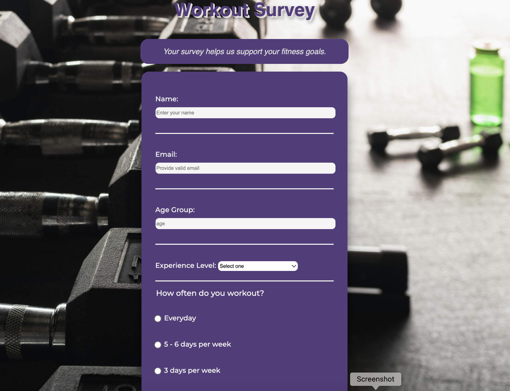

# Workout Survey Form
This project is a simple survey form designed for collecting information about users' workout preferences. The form is created using `HTML` for the structure and CSS for styling. This README.md file provides a detailed walkthrough of the project, including key sections of the `HTML` and CSS code.

## Table of Contents
+ `Project Overview`
+ `Getting Started`
+ `HTML Structure`
+ `CSS Styling`
+ `Code Snippets`
+ `Acknowledgment`
## Project Overview
The Workout Survey Form is a basic web form designed to gather information about users' workout habits. It includes fields for name, email, age group, experience level, workout frequency, preferred workout style, and additional comments. The project uses `HTML` for creating the form structure and CSS for styling.

## Getting Started
To get started with this project, follow these steps:
+ Clone the repository to your local machine.
+ Open the index.`html` file in a web browser to view the survey form.
## HTML Structure
The HTML file `(index.html)` is structured to create a survey form with various input fields. Here's a brief overview of the HTML structure:

<head> section includes metadata and links to external stylesheets.
<body> section contains the form elements, including labels, input fields, and a submit button.
Key HTML elements include:

<form>: The main form container.
<fieldset>: Groups related form elements.
Various input elements for name, email, age, dropdown, radio buttons, checkboxes, and textarea.

## CSS Styling
The CSS file (`style.css`) provides styling for the survey form. Key styling aspects include:

+ Font styles for body, headings, and paragraphs.
+ Background image and color.
+ Form styling including padding, margins, and borders.
+ Styling for input fields, dropdowns, radio buttons, checkboxes, and submit button.
Code Snippets
## HTML Code Snippet
```html
<!-- Input field for name -->
<fieldset>
  <label for="name" id="name-label"> Name: <input type="text" id="name" placeholder="Enter your name" required /></label>
</fieldset>

<!-- Dropdown for experience level -->
<fieldset>
  <label for="dropdown">
    Experience Level:
    <select id="dropdown">
      <option value="">Select one</option>
      <option value="1">Beginner</option>
      <option value="2">Intermediate</option>
      <option value="3">Advance</option>
    </select>
  </label>
</fieldset>

```
## CSS Code Snippet
```css
/* Form styling */
form {
  font-family: "Montserrat", sans-serif;
  color: whitesmoke;
  font-size: 18px;
  font-weight: 450;
  margin: 0 auto;
  max-width: 500px;
  min-width: 300px;
  width: 80%;
  padding: 1em;
  background-color: #563d7c;
  border-radius: 20px;
  box-shadow: 0 20px 25px rgba(0, 0, 0, 0.5);
}

/* Input and textarea styling */
input,
textarea,
select {
  width: 100%;
  margin-top: 10px;
  margin-bottom: 1em;
  border-color: #563d7c;
  border-radius: 6.5px;
  min-height: 2em;
}

/* Submit button styling */
input[type="submit"] {
  display: block;
  width: 80%;
  margin: 0 auto;
  height: 2em;
  font-size: 1.1rem;
  background-color: whitesmoke;
  border-color: #563d7c;
  color: #563d7c;
  font-weight: bold;
  min-width: 300px;
  cursor: pointer;
  box-shadow: 0 8px 10px rgba(68, 66, 66, 0.5);
}
```
## Acknowledgment
Special thanks to `freeCodeCamp` for providing valuable resources and challenges that learners can improve their skills by building projects like this.