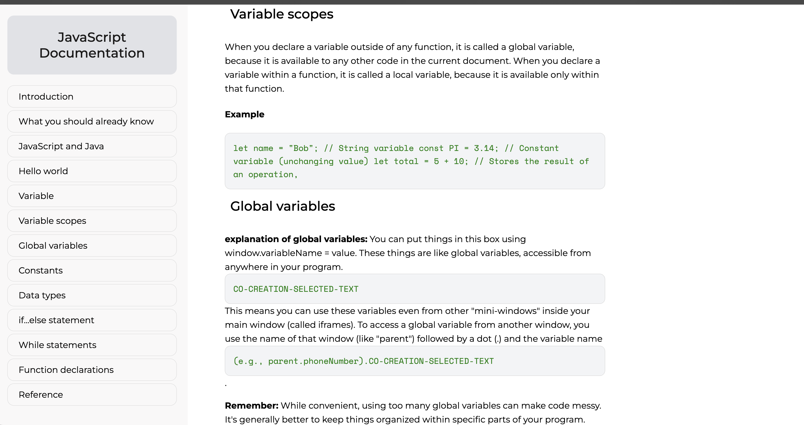

# Technical Documentation Project
This project aims to create a comprehensive documentation webpage for JavaScript beginners to learn about various aspects of the language, such as syntax, data types, control flow, and more. The webpage provides organized sections with explanations and examples for each topic, making it easier for learners to understand and navigate through the content.

## Table of Contents
+ `Project Structure`
+ `Skills Learned`
+ `Code Snippets`
+ `Project Benefits`
+ `Acknowledgment`
+ `Project Structure`

#### The project consists of an HTML file (index.html) and a CSS file (style.css). Below are the details of each file:

### HTML Markup (index.html)

```html
<!DOCTYPE html>
<html lang="en">
  <head>
    <meta charset="UTF-8" />
    <meta name="viewport" content="width=device-width, initial-scale=1.0" />
    <link rel="shortcut icon" href="images/doc.svg" type="image/x-icon" />
    <link rel="stylesheet" href="style.css" />
    <title>JavaScript Documentation</title>
  </head>
  <body>
    <nav id="navbar">
      <header>JavaScript Documentation</header>
      <!-- Navigation links -->
    </nav>

    <main id="main-doc">
      <!-- Sections for different topics -->
      <!-- Each section contains explanations and examples -->
    </main>
  </body>
</html>
```

### CSS Styling (style.css)

```css
/* Set the font family for all elements to Montserrat */
* {
  font-family: "Montserrat", sans-serif;
}

/* Styles for the navigation bar */
#navbar {
  position: fixed;
  left: 0;
  top: 0;
  width: 350px;
  height: 100%;
  background-color: rgba(247, 246, 246, 0.746);
  color: #1a1919;
  padding: 20px;
  box-sizing: border-box;
  overflow-y: auto;
}

/* Styles for the header in the navbar */
#navbar header {
  font-size: 1.5rem;
  margin-bottom: 20px;
  text-align: center;
  padding: 25px 10px;
  background-color: rgba(220, 222, 227, 0.809);
  border: none;
  border-radius: 12px;
}

/* Styles for the navigation links */
.nav-link {
  display: block;
  text-decoration: none;
  color: black;
  margin: 5px 0;
  border: 0.5px solid lightgray;
  padding: 10px 20px;
  box-sizing: border-box;
  border-radius: 12px;
  transition: background-color 0.3s, border-radius 0.3s, box-shadow 0.3s;
}

/* Hover effect for navigation links */
.nav-link:hover,
.nav-link:focus {
  background-color: rgba(220, 222, 227, 0.809);
  border-radius: 12px;
  box-shadow: 0 0 10px rgba(0, 0, 0, 0.3);
}

/* Styles for the main content area */
#main-doc {
  margin: 30px 370px;
  padding: 20px;
  line-height: 1.6;
}

/* Additional Responsiveness */
@media screen and (max-width: 768px) {
  /* CSS for smaller screens */
}

@media screen and (max-width: 576px) {
  /* CSS for extra small screens */
}
```

## Skills Learned
By completing this project, learners will acquire the following HTML and CSS skills:

## HTML Markup:

Understanding the structure of an HTML document.
Creating sections and articles for organizing content.
Adding links for navigation within the document.

## CSS Styling:

Styling navigation bars using position, width, height, background-color, and padding.
Creating responsive layouts with margin and padding.
Styling links for better user experience using text-decoration, color, margin, border, padding, and border-radius.
Code Snippets
Here are some code snippets from the project to illustrate the HTML and CSS implementation:

### Navigation Bar HTML:

```html
<nav id="navbar">
  <header>JavaScript Documentation</header>
  <a class="nav-link" href="#introduction">Introduction</a>
  <!-- Additional navigation links -->
</nav>
```

### Navigation Bar CSS:

```css
#navbar {
  position: fixed;
  left: 0;
  top: 0;
  width: 350px;
  height: 100%;
  background-color: rgba(247, 246, 246, 0.746);
  color: #1a1919;
  padding: 20px;
  box-sizing: border-box;
  overflow-y: auto;
}
```

## Project Benefits
Gain hands-on experience in creating a documentation website.
Enhance understanding of HTML document structure and CSS styling techniques.
Practice organizing and presenting information in a user-friendly manner.
Develop skills in responsive web design for better accessibility across devices.

## Acknowledgment
This project was created as part of the `FreeCodeCamp curriculum`, a platform dedicated to providing free resources and coding challenges to help individuals learn to code. I appreciate the valuable support and resources provided by` FreeCodeCamp` in enabling learners to enhance their programming skills.
