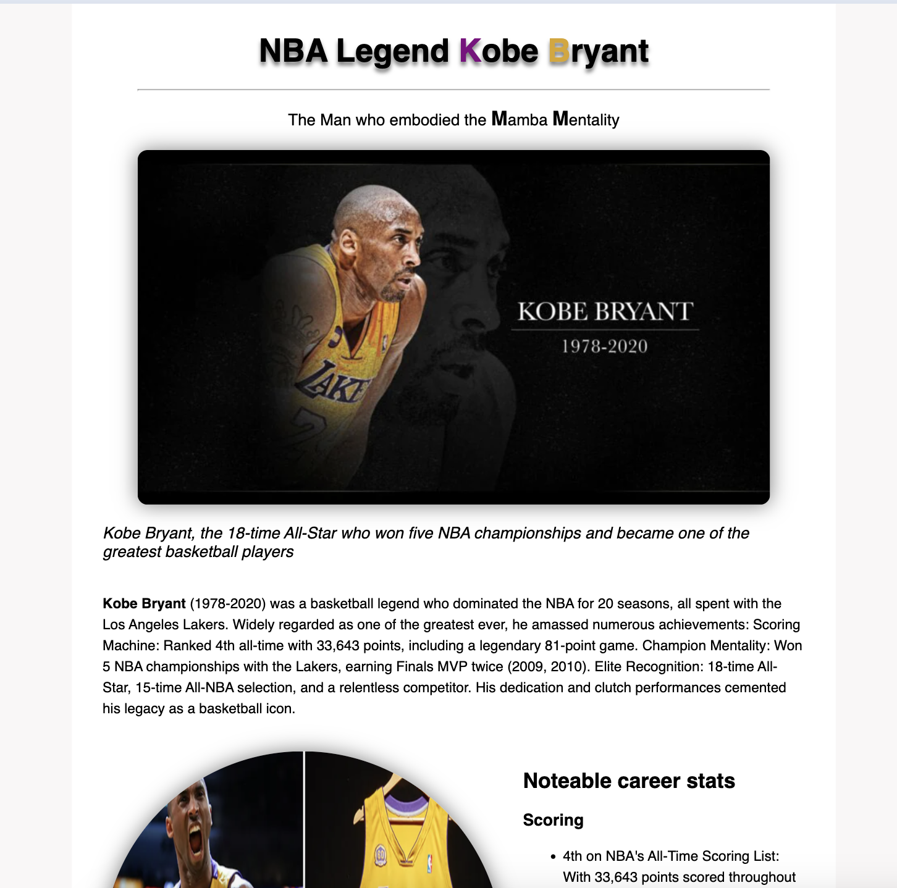

# Building a Tribute Page:
This project helps you develop essential skills for creating web pages. Here's a breakdown of the key concepts one would learne, accompanied by illustrative code snippets:

## Table of Contents| Skills Learned

+ `HTML Structure: #html-structure`
+ `Document Structure`
+ `Semantic Elements`
+ ` CSS Styling: #css-styling`
+ `Basic Styles`
+ `Image Styling with Shadow Effect`
+ `Text Formatting with Font Family`
+ `Additional Considerations: #additional-considerations`
+ `Responsiveness`
+ `Accessibility`

## HTML Structure:

### Document Structure (index.html):

```html
<!DOCTYPE html>
<html lang="en">
  <head>
    <meta charset="UTF-8" />
    <meta name="viewport" content="width=device-width, initial-scale=1.0" />
    <link rel="shortcut icon" href="images/portfolio.svg" type="image/x-icon" />
    <link rel="stylesheet" href="style.css" />
    <title>Tribute Page</title>
  </head>
  <body>
    <main id="main"></main>
  </body>
</html>
```
#### This code outlines the basic HTML structure:

<!DOCTYPE html> declares the document type as HTML.

<html> element is the root element of the webpage.

<head> section contains metadata like character encoding and title.

<body> section contains the visible content of the page.

<main> element is the main container for the tribute content.

### Semantic Elements (tribute-info.html):
```html
<div id="tribute-info">
  <p><span id="tribute-person">Kobe Bryant</span> (1978-2020) was a basketball legend...</p>
</div>
```

### This snippet demonstrates using semantic elements:

`div with an ID` for grouping content (tribute information).
`p` for the paragraph containing tribute information.
`span with an ID` to highlight "Kobe Bryant" within the paragraph.
 CSS Styling:

## Basic Styles (style.css):

```css
body {
  margin: 0;
  padding: 0 100px;
  background-color: rgb(249, 247, 247);
}
```
### This snippet shows basic body styles:

`margin: 0;` removes default browser margins.

`padding: 0 100px`; adds padding for content to be centered horizontally.

`background-color` sets a light gray background color.

Image Styling with Shadow Effect `(#image):`

```css
#image {
  max-width: 90%;
  height: auto;
  border-radius: 10px;
  box-shadow: 0 0 20px 0 rgba(0, 0, 0, 0.5);
}
```

### This snippet styles the main image:

`max-width: 90%` ensures the image scales proportionally within its container.

height: auto maintains the image's aspect ratio.

`border-radius: 10px` adds rounded corners.

box-shadow creates a subtle drop shadow effect.

Text Formatting with Font Family `(#tribute-info p)`:

```css
#tribute-info p {
  line-height: 1.5;
  font-family: "Quicksand", sans-serif;
}
```
### This snippet styles the paragraph within the tribute information section:
`line-height: 1.5` increases line spacing for better readability.
`font-family` sets the font family to "Quicksand" or a fallback sans-serif font.
Additional Considerations:
## Responsiveness: 
The tribute page doesn't explicitly include responsive design techniques in this example. However, using `media queries in CSS` allows you to adapt the layout for different screen sizes.
## Accessibility:
 Basic accessibility features are implemented with proper use of alt attributes for images and potentially using semantic HTML elements like `h2` and` h3` for subheadings within the tribute information section.
## Conclusion
By building this tribute page, you've gained valuable experience in fundamental `HTML` elements and `CSS` styling techniques. This foundation is crucial for further web development endeavors.

## Acknowledgement
This project is built upon the guidance provided by `FreeCodeCamp`. Their challenges and resources offer valuable learning opportunities for aspiring web developers.
